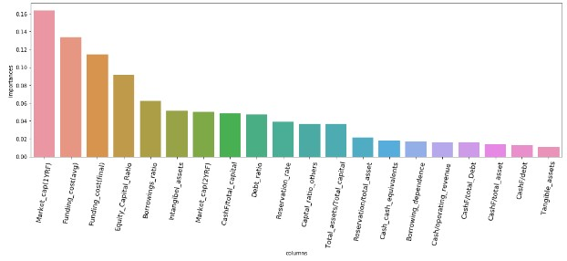
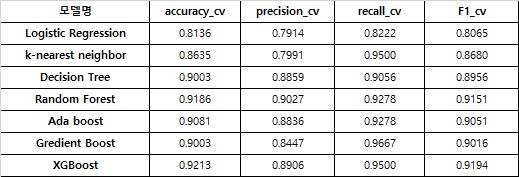

## Predicting Delisting Company with ML Models

**1. Summary**
 - 코스피시장에 상장되어 있거나 상장폐지된 기업의 다양한 데이터를 수짐 및 전처리
 - RamdomForest, AdaBoost등 다양한 머신러닝 분류 알고리즘으로 상장폐지 기업을 예측하기 위해 훈련 및 평가
 - XGBoost 분류기의 성능이 가장 우수(정확도 : 0.9213, F1-score : 0.9194)

**2. Objective**
 - 다양한 머신러닝 알고리즘을 이용하여 코스피시장에서의 1년 후 상장폐지 기업 예측

**3. Data set**
 - 1994년 ~ 2019년 코스피시장에 상장되어 있거나 상장폐지된 기업의 재무비율 및 시가총액 등의 시장데이터(출처 : DataGuide, KRX)
 - 연도별 기업들의 자기자본비율, 부채비율, 자기자본비율 유보율 등 총 24개 Features로 구성
 - 총 1502개 기업중 상장폐지 기업은 370개(상장폐지기업의 경우 "1", 상장기업의 경우 "0"으로 Labeling)
 

**4. Preprocessing & Feature Eng.** 
 - "N/A" 또는 "자본잠식"등 문자형으로 표시된 값을 각 feature별 특성을 감안한 값으로 대체(ex: 자기자본비율이 "완전잠식"값일 경우 -1로 대체)
 - 부채비율, 차입금비율 등의 결측값은 Target class(1 또는 0)별 평균값으로 대체
 - 상관관계가 0.95 이상 변수 제외
 - RandomForest & XGBoost Classifier를 이용하여 각 features들의 중요도를 산출
 - "1년전 시가총액"과 "차입부채조달금리"의 중요도가 타 features대비 상대적으로 높음 
 - Features Importance
  
  
 
**5. Model tunning**
 - 상장을 유지하고있는 종목대비 상장폐지종목수의 과소에 따른 데이터 불균형 해소(Random over-sampling)
 - 전체 data set에서 train set은 75%, test set은 25%로 분리하여 train 진랭
 - [Logistic Regression](https://ko.wikipedia.org/wiki/%EB%A1%9C%EC%A7%80%EC%8A%A4%ED%8B%B1_%ED%9A%8C%EA%B7%80), [Decision tree](https://ko.wikipedia.org/wiki/%EA%B2%B0%EC%A0%95_%ED%8A%B8%EB%A6%AC_%ED%95%99%EC%8A%B5%EB%B2%95), [RandomForest](https://ko.wikipedia.org/wiki/%EB%9E%9C%EB%8D%A4_%ED%8F%AC%EB%A0%88%EC%8A%A4%ED%8A%B8), [k-Nearest Neighbour](https://ko.wikipedia.org/wiki/K-%EC%B5%9C%EA%B7%BC%EC%A0%91_%EC%9D%B4%EC%9B%83_%EC%95%8C%EA%B3%A0%EB%A6%AC%EC%A6%98), [Adaboost](https://ko.wikipedia.org/wiki/%EC%97%90%EC%9D%B4%EB%8B%A4%EB%B6%80%EC%8A%A4%ED%8A%B8), [Gredient Boost](https://en.wikipedia.org/wiki/Gradient_boosting), [XGBoost](https://brunch.co.kr/@snobberys/137) 분류 모델 사용
 - Sklean패키지의 GridSearchCV를 이용하여 최적 파라미터 산출  
 
 
**6. Results**
 - 정확도와 F1-score 모두 XGBoost 분류기의 성능이 가장 우수, 반면 Logistic Regression 분류기의 성능이 가장 낮음 
 - Results table
 
 
   
